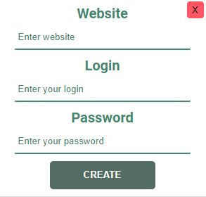
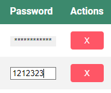

# Password manager

## About

Manage all your passwords for different accounts (mails, devices, accounts, servers, etc.).
You can add/edit/delete/reveal passwords on the dashboard after login.

## Actions

### You can register or login with existing accounts:

* login: **admin**
* password: **admin**


* login: **myLogin**
* password: **myPassword**

### To add a new password, click the "NEW" button:


### To remove the password, press the red 'X' button. To change the password, double-click on it:



## Stack used
* **HTML**.
* **CSS(SCSS)**.
* **React**.
* **Typescript**.
* **[Json-server](https://github.com/typicode/json-server)**.

## Environment requirements
* **Node v14**.
* **npm v6**.

##  How to work with. STEPS
1. Download or clone repository `git clone https://github.com/TwoAndMore/password-manager`.
2. Open project folder with code editor (VS Code, WebStorm, other).
3. Run ```npm install``` in terminal.
4. Install JSON server ```npm install -g json-server```.
5. Start JSON server ```json-server -p 5000 src/data.json```.
6. Open second terminal and run ```npm start```.
7. If tab does not open, go to ```http://localhost:3000``` in your browser.
